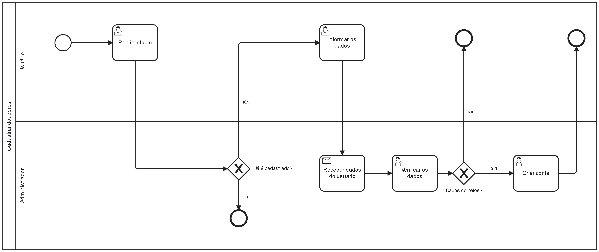

### 3.3.1 Processo 1 – CADASTRAR DOADORES

Cadastrar doadores, é um procedimento fundamental que consiste no cadastro realizado por nossos usuários, para acessarem os serviços oferecidos em nossa plataforma. Por isso é fundamental que esta parte seja a mais simples e prática possível. Há oportunidades de aprimoramento, tais como a implementação do login social, possibilitando que os usuários utilizem suas contas em redes sociais para se cadastrarem, o que agilizaria significativamente o processo de login. Além disso, é necessário tornar o processo acessível a todos, adaptando o formulário de cadastro para atender às necessidades de pessoas com deficiência, entre outras melhorias diversas.

#### Detalhamento das atividades

**Realizar login**

| **Campo**       | **Tipo**         | **Restrições** | **Valor default** |
| ---             | ---              | ---            | ---               |
| E-mail           | Caixa de Texto   | Formato de e-mail |                |
| Senha           | Caixa de Texto   | Mínimo de 8 caracteres |           |

| **Comandos**         |  **Destino**                   | **Tipo** |
| ---                  | ---                            | ---               |
| Entrar               | Fim do Processo 1              |        |
| Cadastrar            | Limpa os campos de entrada |                   |

**Informar os dados**

| **Campo**       | **Tipo**         | **Restrições** | **Valor default** |
| ---             | ---              | ---            | ---               |
| E-mail           | Caixa de Texto   | Formato de e-mail |                |
| Senha           | Caixa de Texto   | Mínimo de 8 caracteres |           |
| CPF           |Número  | Formato de CPF (11 dígitos) |                |
| Data de nascimento           | Data   | Formato de data de nascimento |                |
| Nome        | Caixa de Texto   | Restrição de caracteres(50) |                |
| Telefone           | Número | Formato de número telefônico |                |

| **Comandos**         |  **Destino**                   | **Tipo** |
| ---                  | ---                            | ---               |
| Entrar               | Fim do Processo 1              | Default           |
| Cadastrar            | Início do processo de cadastro |                   |

**Verificar os dados**

| **Campo**       | **Tipo**         | **Restrições** | **Valor default** |
| ---             | ---              | ---            | ---               |
| E-mail           | Caixa de Texto   | Não editavel |                |
| Senha           | Caixa de Texto   | Não editabel |           |
| CPF           |Número  | Não editavel |                |
| Data de nascimento           | Data   | Não editavel |                |
| Nome        | Caixa de Texto   | Não editavel |                |
| Telefone           | Número | Não editavel |                |

| **Comandos**         |  **Destino**                   | **Tipo** |
| ---                  | ---                            | ---               |
| Confirmar               | Atividade de criar conta ou realizar login              |         |
| Cancelar           | Processo de informar os dados |                   |

**Criar Conta**

| **Campo**       | **Tipo**         | **Restrições** | **Valor default** |
| ---             | ---              | ---            | ---               |
| E-mail           | Caixa de Texto   | Não editavel |                |
| Senha           | Caixa de Texto   | Não editavel |           |
| CPF           |Número  | Não editavel |                |
| Data de nascimento           | Data   | Não editavel |                |
| Nome        | Caixa de Texto   | Não editavel |                |
| Telefone           | Número | Não editavel |                |

| **Comandos**         |  **Destino**                   | **Tipo** |
| ---                  | ---                            | ---               |
|Criar Conta           | Fim do Processo 1              | Default           |
