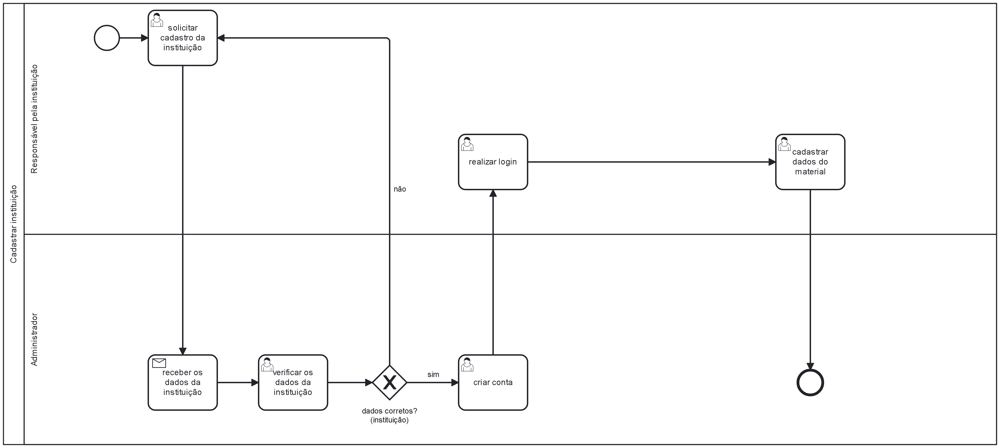

### 3.3.2 Processo 2 – CADASTRAR INSTITUIÇÕES

Cadastrar Instituições, nosso processo concentra-se no registro das instituições que necessitam de materiais. Algumas das oportunidades de melhoria que identificamos incluem: implementação de um sistema de cadastro automatizado, no qual os dados não precisariam ser enviados por e-mail e o cadastro não seria realizado manualmente. Em vez disso, todo o processo, incluindo a verificação da instituição e a criação da conta, seria realizado por meio de uma página dedicada, melhorando e automatizando todo o procedimento. Isso facilitaria significativamente o processo, incentivando o aumento do número de empresas parceiras em nosso sistema.

#### Detalhamento das atividades

**Solicitar cadastro da instituição**

| **Campo**       | **Tipo**         | **Restrições** | **Valor default** |
| ---             | ---              | ---            | ---               |
| Nome           | Caixa de Texto   | Formato de nome empresarial |                |
| CNPJ           | Número  | 14 números     |      |
| Cep           | Número  |8 números  |          |
| Bairro           | Caixa de texto  |50 Caracteres |          |
| Nome da Rua           |Caixa de texto  | 50 Caracteres |          |
| Número do estabelecimento | Número | Número da rua |        |

| **Comandos**         |  **Destino**                   | **Tipo** |
| ---                  | ---                            | ---               |
| Criar Conta               | Envia notificação para os administradores |          |
| Cancelar            |Finalizar Processo |                   |

**Materiais necessitados**

| **Campo**       | **Tipo**         | **Restrições** | **Valor default** |
| ---             | ---              | ---            | ---               |
| Nome      | Caixa de Texto        | 50 caracteres |  |
| Quantidade       | Número         | 3 números |  |

**Verificar os dados da instituição**

| **Campo**       | **Tipo**         | **Restrições** | **Valor default** |
| ---             | ---              | ---            | ---               |
| Nome           | Caixa de Texto   | Não editavel |                |
| CNPJ           | Número  | Não editavel     |      |
| Cep           | Número  |Não editavel  |          |
| Bairro           | Caixa de texto  |Não editavel |          |
| Nome da Rua           |Caixa de texto  | Não editavel |          |
| Número do estabelecimento | Número | Não editavel |        |
| Materiais desejados pela instituição | Caixa de texto | 50 caracteres |        |

| **Comandos**         |  **Destino**                   | **Tipo** |
| ---                  | ---                            | ---               |
| Editar              | Tela para edição dos dados              |          |
| Cancelar            |Envia um email informando que os dados estão incorretos |                   |

**Criar Conta**

| **Campo**       | **Tipo**         | **Restrições** | **Valor default** |
| ---             | ---              | ---            | ---               |
| Nome           | Caixa de Texto   | Formato de nome empresarial |                |
| CNPJ           | Número  | 14 números     |      |
| Cep           | Número  |8 números  |          |
| Bairro           | Caixa de texto  |50 Caracteres |          |
| Nome da Rua           |Caixa de texto  | 50 Caracteres |          |
| Número do estabelecimento | Número | Número da rua |        |
| Materiais desejados pela instituição | Caixa de texto | 50 caracteres |        |

| **Comandos**         |  **Destino**                   | **Tipo** |
| ---                  | ---                            | ---               |
| Criar Conta               | Enviar confirmação dos dados            |          |
| Cancelar            |Limpa os campos de digitação |                   |

**Confirmar dados da instituição**

| **Campo**       | **Tipo**         | **Restrições** | **Valor default** |
| ---             | ---              | ---            | ---               |
| Nome           | Caixa de Texto   |Não editavel|                |
| CNPJ           | Número  | Não editavel  |      |
| Cep           | Número  |Não editavel  |          |
| Bairro           | Caixa de texto  |Não editavel |          |
| Nome da Rua           | Caixa de texto  |Não editavel  |          |
| Número do estabelecimento         | Número | Não editavel |        |
| Materiais desejados pela instituição | Caixa de texto | 50 caracteres |        |

| **Comandos**         |  **Destino**                   | **Tipo** |
| ---                  | ---                            | ---               |
| Confirmar              | Conta criada           |          |
| Incorreto              | Enviar notificação para alteração dos dados            |          |

**Solicitar alteração dos dados**

| **Campo**       | **Tipo**         | **Restrições** | **Valor default** |
| ---             | ---              | ---            | ---               |
| Nome           | Caixa de Texto   |Não editavel|                |
| CNPJ           | Número  | Não editavel  |      |
| Cep           | Número  |Não editavel  |          |
| Bairro           | Caixa de texto  |Não editavel |          |
| Nome da Rua           | Caixa de texto  |Não editavel  |          |
| Número do estabelecimento         | Número | Não editavel |        |
| Materiais desejados pela instituição | Caixa de texto | Não editavel |        |

| **Comandos**         |  **Destino**                   | **Tipo** |
| ---                  | ---                            | ---               |
| Confirmar              | Conta criada           |          |
| Incorreto              | Enviar notificação para alteração dos dados            |          |

**Ajustar dados da conta**

| **Campo**       | **Tipo**         | **Restrições** | **Valor default** |
| ---             | ---              | ---            | ---               |
| Nome           | Caixa de Texto   | Formato de nome empresarial |                |
| CNPJ           | Número  | 14 números     |      |
| Cep           | Número  |8 números  |          |
| Bairro           | Caixa de texto  |50 Caracteres  |          |
| Nome da Rua           |Caixa de texto  | 50 Caracteres |          |
| Número dao estabelecimento          | Número | Número da rua |        |
| Materiais desejados pela instituição | Caixa de texto | 50 caracteres |        |

| **Comandos**         |  **Destino**                   | **Tipo** |
| ---                  | ---                            | ---               |
| Criar Conta               | Fim do Processo 2              |          |
| Cancelar            |Limpa os campos de digitação |                   |

