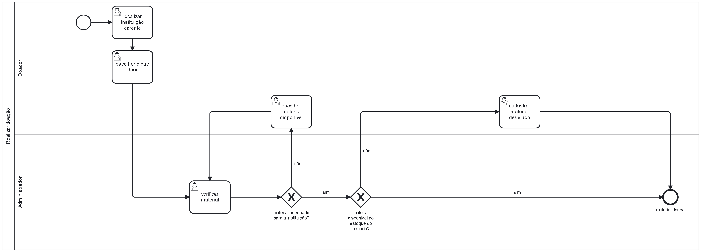

### 3.3.4 Processo 4 – REALIZAR DOAÇÕES

Realizar doações, o processo final da nossa aplicação é realizar doações, visando direcionar os materiais necessários para as instituições que deles precisam. Uma das propostas de melhoria, seria a melhora na comunicação com doadores, o que irá aprimorar os canais de comunicação com os doadores, fornecendo feedback sobre como suas doações estão sendo utilizadas e mantendo-os informados sobre os projetos beneficiados. Além disso, uma comunicação entre instituições e doadores para sugerir novos materiais, ou uma forma para visualizar como as doações estão sendo efetivas para as instituições.

#### Detalhamento das atividades

**Localizar instituição carente**

| **Campo**       | **Tipo**         | **Restrições** | **Valor default** |
| ---             | ---              | ---            | ---               |
| Nome da instituição        |     Texto            | Não editável            |                   |

| **Comandos**         |  **Destino**                   | **Tipo**          |
| ---                  | ---                            | ---               |
|     Entrar      |   Escolher o que doar          |                   |

**Escolher o que doar**

| **Campo**       | **Tipo**         | **Restrições** | **Valor default** |
| ---             | ---              | ---            | ---               |
| Itens           | Seleção única    | Produtos já cadastrados |                |

| **Comandos**         |  **Destino**                   | **Tipo** |
| ---                  | ---                            | ---               |
| Cadastrar o material |  Processo 3        | default           |
| Comprar material     | Processo de compra de material  |                   |
|  Cancelar            | Localizar Instituições  |                   |

**Verificar o material**

| **Campo**       | **Tipo**         | **Restrições** | **Valor default** |
| ---             | ---              | ---            | ---               |
| Itens           | Seleção única    | Não editavel |                |
| Quantidade      | Número           | Não editavel |           |

| **Comandos**         |  **Destino**                   | **Tipo** |
| ---                  | ---                            | ---               |
| Confirmar   |  Processo de compra ou de cadastro de material        | default           |
|  Rejeitar            |   Processo escolher material disponivel   |                   |                       |

**Escolher material disponivel**

| **Campo**       | **Tipo**         | **Restrições** | **Valor default** |
| ---             | ---              | ---            | ---               |
| Itens           | Seleção única    | Produtos já cadastrados |                |
| Quantidade      | Número           | Máximo 100 unidades |           |

| **Comandos**         |  **Destino**                   | **Tipo** |
| ---                  | ---                            | ---               |
| Cadastrar o material |  Processo 3        | default           |
| Comprar material     | Processo de compra de material  |                   |
|  Cancelar            | Localizar Instituições  |                   |

**Comprar material**

| **Campo**       | **Tipo**         | **Restrições** | **Valor default** |
| ---             | ---              | ---            | ---               |
|  Itens          |   Campo de texto               |   Não editável             |                   |
|  Quantidade          |  Número            |   Não editável             |                   |
|  Total          |  Número            |   Não editável             |                   |

| **Comandos**         |  **Destino**                   | **Tipo**          |
| ---                  | ---                            | ---               |
|      Confirmar       |   Processo Confirmar doação            |                   |
|      Cancelar       |    Processo Escolher o que doar            |                   |

**Cadastrar material desejado**
(PROCESSO 3)
| **Campo**       | **Tipo**         | **Restrições** | **Valor default** |
| ---             | ---              | ---            | ---               |
| Item            | Seleção única    | Escolha de algum dos materiais predefinidos |                |
| Estado          | Seleção única    | Bom , médio , ruim |                |
| Data de validade| Data             |                  |                  |

| **Comandos**         |  **Destino**                   | **Tipo** |
| ---                  | ---                            | ---               |
| Enviar               | Receber dados do material             | default           |
| Cancelar             | Retoma o processo do início  | default           |

**Confirmar doação**

| **Campo**       | **Tipo**         | **Restrições** | **Valor default** |
| ---             | ---              | ---            | ---               |
|  Itens          |   Campo de texto               |   Não editável             |                   |
|  Quantidade          |  Número            |   Não editável             |                   |
|  Total          |  Número            |   Não editável             |                   |
| Instituição     |  Área de texto      | Não editável      |                    |

| **Comandos**         |  **Destino**                   | **Tipo**          |
| ---                  | ---                            | ---               |
|      Doar       |  Fim do processo 4           |                   |
|      Cancelar       |  Processo Comprar material     |                   |
