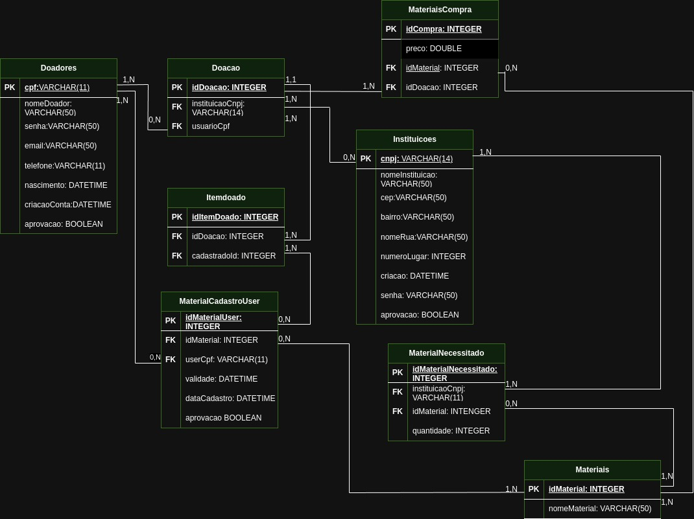

## 4. Projeto da solução

### 4.1. Modelo de dados

---

### 4.2. Tecnologias

| **Dimensão**   | **Tecnologia**  | **Descrição** |
| ---            | ---             | ----------- |
| SGBD           | MySQL           | Utilizamos para criar as tabelas do banco de dados e toda estrutura do mesmo |
| Front end      | HTML+CSS+JS     | Utilizamos para estilização das nossas telas web e para realizar requisições para as APIs | 
| Back end       | Java SpringBoot | Utilizamos para fazer um server HTTP com Maven, com conexão com banco de dados |
| Deploy         | Azure AKS       | Utilizamos para deployment das aplicações em banco de dados |
| Testes locais  | Docker          | Utilizamos para realizar testes da APIs|
