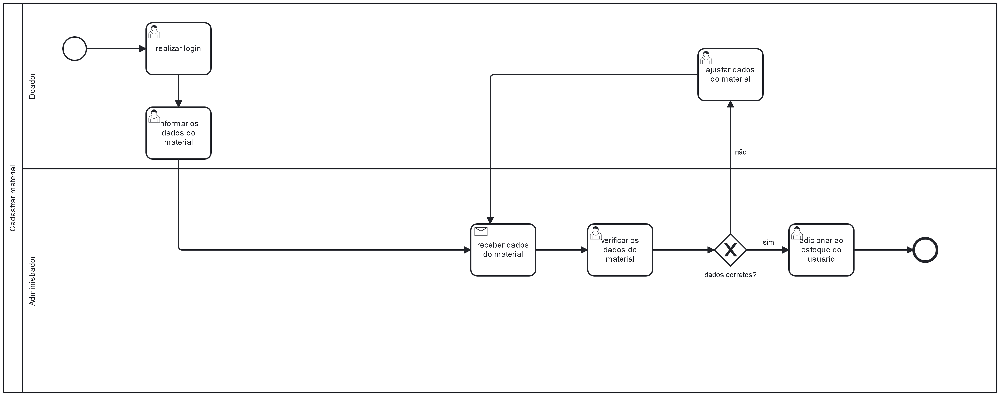

### 3.3.3 Processo 3 – CADASTRAR MATERIAL

Cadastrar material, o processo concentra-se na compra dos materiais que serão necessários na doação para as instituições. Algumas oportunidades de melhoria, são: adicionar uma funcionalidade que permita a doação de dinheiro, ampliando as opções de contribuição para além do cadastro de materiais.

#### Detalhamento das atividades

**Informar os dados do material**

| **Campo**       | **Tipo**         | **Restrições** | **Valor default** |
| ---             | ---              | ---            | ---               |
| Item            | Seleção única    | Escolha de algum dos materiais predefinidos |                |
| Data de validade| Data             |                  |                  |

| **Comandos**         |  **Destino**                   | **Tipo** |
| ---                  | ---                            | ---               |
| Enviar               | Receber dados do material             | default           |
| Cancelar             | Retoma o processo do início  | default           |

**Realizar Login**

| **Campo**       | **Tipo**         | **Restrições** | **Valor default** |
| ---             | ---              | ---            | ---               |
|       Email          |         Campo de texto         |       Formato de email         |                   |
|       Senha          |         Campo de texto         |       Formato de senha         |                   |

| **Comandos**         |  **Destino**                   | **Tipo**          |
| ---                  | ---                            | ---               |
|       Entrar         | Informar os dados do material  |                   |
| Cancelar             | Limpar formulario              |                   |

**Verificar os dados do material**
| **Campo**       | **Tipo**         | **Restrições** | **Valor default** |
| ---             | ---              | ---            | ---               |
| Item            | Caixa de texto   |  Não editavel |                |
| Estado          | Caixa de texto   | Não editavel |                |
| Data de validade| Data             |  Não editavel|                  |

| **Comandos**         |  **Destino**                   | **Tipo**          |
| ---                  | ---                            | ---               |
|       Confirmar         | Processo de adicionar ao estoque do usuario  |                   |
| Cancelar             | Processo ajustar os dados do material           |                   |

**Ajustar os dados do material**

| **Campo**       | **Tipo**         | **Restrições** | **Valor default** |
| ---             | ---              | ---            | ---               |
| Item            | Seleção única    | Escolha de algum dos materiais predefinidos |                |
| Estado          | Seleção única    | Bom , médio , ruim |                |
| Data de validade| Data             |                  |                  |

| **Comandos**         |  **Destino**                   | **Tipo** |
| ---                  | ---                            | ---               |
| Enviar               | Processo de receber dados do material             | default           |
| Cancelar             | Processo cancelado  | default           |

**Adicionar ao estoque do usuario**

| **Campo**       | **Tipo**         | **Restrições** | **Valor default** |
| ---             | ---              | ---            | ---               |
| Item            | Seleção única    | Escolha de algum dos materiais predefinidos |                |
| Estado          | Seleção única    | Bom , médio , ruim |                |
| Quantidade      | Numero           | Somente numeros                 |                  |

| **Comandos**         |  **Destino**                   | **Tipo** |
| ---                  | ---                            | ---               |
| Adicionar             | Fim do Processo 3           | default           |

